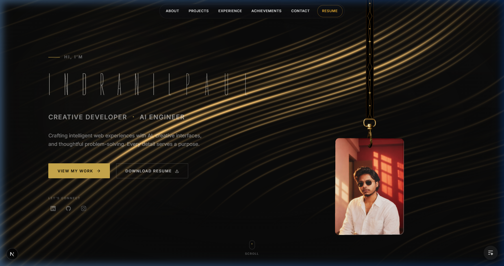
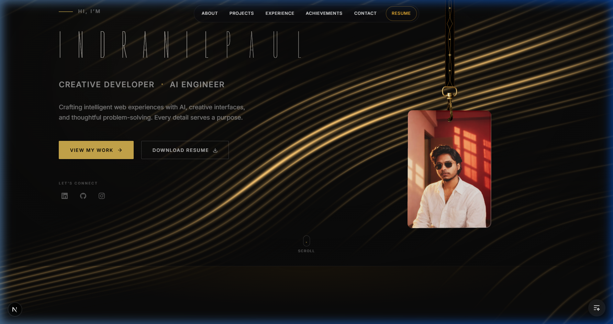
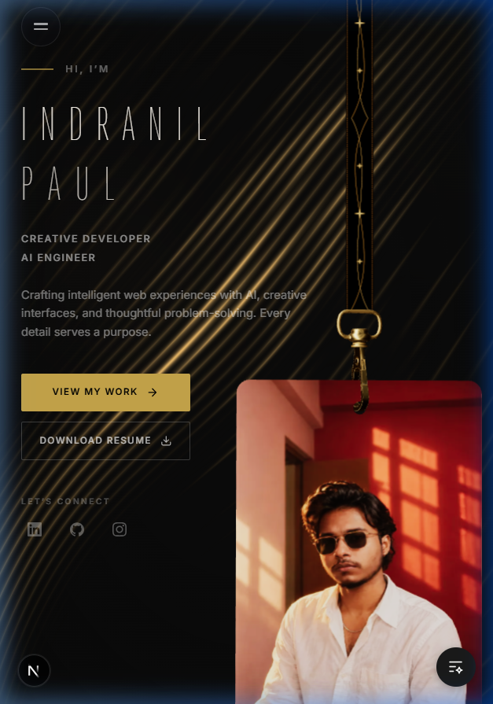
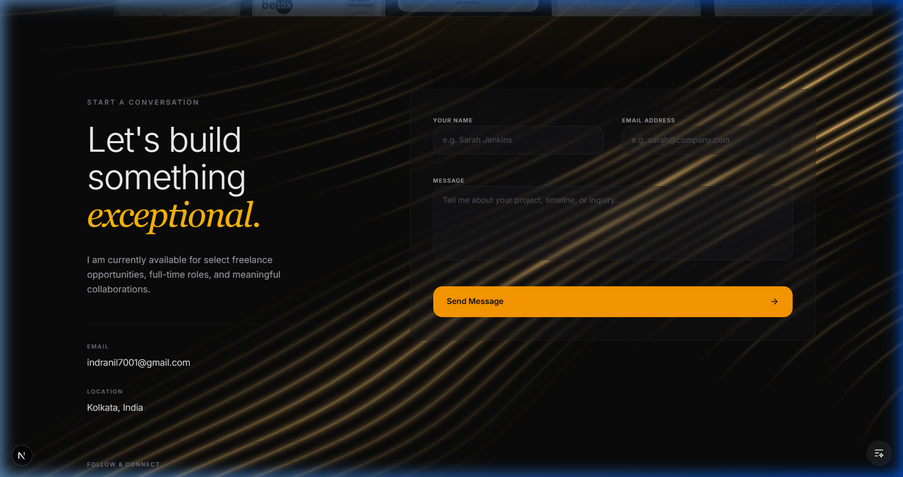

# Portfolio — Indranil Paul

<p align="center">
  A production-ready, cinematic developer and photographer portfolio built with Next.js, Three.js, and GSAP. Designed to showcase engineering capability through rich, interactive visual experiences while maintaining uncompromising performance and accessibility.
</p>

<p align="center">
  <a href="https://github.com/indraaaa29/My-Portfolio"><strong>View Repository</strong></a>
</p>

<p align="center">
  
  
  
  
  
  
</p>

---



## Overview

This project is a premium personal portfolio built to serve dual purposes: acting as a traditional resume/showcase, and standing as an interactive technical demonstration itself. The visual direction is heavily inspired by cinematic, dark-themed aesthetics with striking gold accents. 

What makes this implementation technically interesting is the balance between highly demanding visual interactions (WebGL, physics simulations, complex DOM animations) and strict production standards (SSR, 0 accessibility violations, flawless performance metrics).

## Interactive Lanyard



A centerpiece of the visual experience is the fully interactive, physics-based developer lanyard integrated into the hero section.

- **Technology**: Built using `React Three Fiber` and `@react-three/rapier` for rigid-body physics.
- **Implementation**: The lanyard simulates a physical strap and badge using spherical and rope joints. The user can drag, pull, and toss the badge around the screen, and the physics engine calculates gravity, momentum, and collision in real-time.
- **Design Philosophy**: It breaks the static nature of standard web portfolios, inviting immediate tactile interaction and creating a memorable, playful first impression without disrupting the serious cinematic tone.

## Features

- **Cinematic Portfolio Hero**: A dark, atmospheric landing experience using dynamic `TextPressure` variable fonts and particle backgrounds.
- **Interactive Physics-based Lanyard**: Real-time WebGL interactive 3D physics badge.
- **Responsive Layout**: Pixel-perfect adaptation across desktop, tablet, and mobile breakpoints.
- **Smooth Lenis Scrolling**: Native-feeling, hardware-accelerated momentum scrolling.
- **GSAP Animations**: Precision-timed scroll-triggered reveals and transitions.
- **Custom Cursor**: Interactive custom cursor tracking.
- **Dark Cinematic Visual System**: Centralized design tokens enforcing a strict dark-gold palette.
- **Resume Integration**: Seamless Google Drive resume linking.
- **Accessibility Support**: Keyboard-navigable structure, semantic HTML, and proper focus rings.
- **Reduced-Motion Support**: Automatic fallback and disabled physics for users preferring reduced motion.
- **SEO Ready**: Dynamically generated `sitemap.xml`, `robots.txt`, and comprehensive metadata.

## Gallery

| Mobile Experience | Contact & Socials |
| :---: | :---: |
|  |  |

## Tech Stack

| Technology | Purpose |
|---|---|
| **Next.js 16** | Application framework, SSR, routing, and metadata generation |
| **React 19** | UI architecture and component state |
| **TypeScript** | Strict type safety and interface definitions |
| **Tailwind CSS** | Utility-first styling and centralized design tokens |
| **Three.js** | Low-level 3D rendering pipeline |
| **React Three Fiber** | Declarative React integration for Three.js scene graph |
| **Rapier** | Fast, deterministic Rust-based physics engine for the Lanyard |
| **GSAP** | Timeline-based DOM animation and ScrollTrigger effects |
| **Lenis** | Smooth scrolling infrastructure |

## Architecture

The project leverages the **Next.js App Router** paradigm, keeping as much as possible inside Server Components. 

- **Server-First Base**: `layout.tsx` and `page.tsx` are rendered entirely on the server to ensure high performance and immediate First Contentful Paint.
- **Interactive Islands**: Components demanding client interactivity (like `Lanyard.tsx`, GSAP components, and the `Navbar`) use the `"use client"` directive, strictly isolating their execution to minimize the JavaScript payload sent to the browser.
- **Physics Isolation**: The Rapier physics engine and Three.js canvas are isolated entirely within the Lanyard component to avoid polluting the global DOM rendering cycle.
- **Animation Pipeline**: Animations are delegated to GSAP via `useGSAP` hooks mapped to Lenis scroll events, bypassing React's rendering loop entirely for hardware-accelerated 60fps performance.

## Project Structure

```text
src/
├── app/
│   ├── globals.css
│   ├── layout.tsx
│   ├── page.tsx
│   ├── robots.ts
│   └── sitemap.ts
├── components/
│   ├── CustomCursor.tsx
│   ├── SmoothScroll.tsx
│   ├── background/
│   ├── hero/
│   ├── navbar/
│   ├── portfolio/
│   └── reactbits/
│       └── Lanyard.tsx
├── data/
│   ├── achievements.ts
│   ├── portfolioData.ts
│   └── projects.ts
├── hooks/
│   └── use-media-query.ts
└── lib/
    ├── config.ts
    ├── design-tokens.ts
    ├── scroll-lock.ts
    └── utils.ts

docs/
└── screenshots/
    ├── connect.png
    ├── hero-desktop.png
    ├── hero-mobile.png
    └── navigation.png
```
